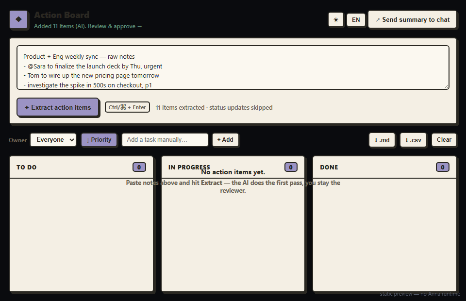

# Action Board — Anna AI-Native App

[](https://github.com/PugarHuda/action-board/actions/workflows/ci.yml)
[](LICENSE)


**Paste messy meeting notes → get a structured action board you actually trust.**

🔗 **Live UI preview:** https://bundle-rust.vercel.app · **Repo:** https://github.com/PugarHuda/action-board
_(The live link is a static, SDK-free render of the UI so you can see it instantly. The
functional app — AI extraction, storage, chat — runs inside Anna via `anna-app dev`.)_



> _Extract → review/approve → organize across To Do / In Progress / Done._
> Static shots: [full board](docs/screenshot.png) · [light theme](docs/screenshot-light.png) · [empty state](docs/screenshot-empty.png) · [filtered by owner](docs/screenshot-filtered.png) · [mobile](docs/screenshot-mobile.png)

Action Board turns a raw brain-dump or meeting transcript into editable action-item
cards (**task · owner · deadline · priority**) that you approve and drag across
**To Do / In Progress / Done**. The AI does the first pass; the human stays the
reviewer. The board persists automatically, and one click pushes a clean summary
back into the conversation.

This is the hackathon answer to *"what comes after a chatbot?"* — the assistant
**participates inside a workflow** (extracting structure, updating the board) while
the human keeps final say. It uses four Anna primitives together:
**App UI window · Executa tool call · persistent storage (APS) · chat write-back.**

---

## How AI is used (and why it's "meaningful", not a tempel-an)

1. You paste notes and hit **Extract**.
2. The UI calls the `action-triage` **Executa tool** via `tools.invoke`.
3. Inside the tool, it **borrows the host LLM** through reverse sampling
   (`sampling/createMessage`) — **no API key required** — to extract a clean,
   structured JSON list of action items.
4. Cards render in the UI. You **edit, approve, delete, and drag** them — human review.
5. State is saved to **APS** (`storage.set`) and survives reloads / other devices.
6. **Send summary to chat** posts a structured artifact + readable message back into
   the conversation (`chat.append_artifact` / `chat.write_message`).

The LLM in the conversation can also open the app directly:
`open_app_view(view="board", payload={ notes: "<raw text>" })` → the board
auto-extracts. (See `system_prompt_addendum` in `manifest.json`.)

### Board features

- **Source badges** — every card shows whether it came from the **AI** model, the
  rule-based **parser**, or was added **manually**.
- **Quick-add** — type a task in the toolbar to add one by hand (still parsed for
  `@owner`, dates, and priority).
- **Filter by owner** + **sort each column by priority**.
- **Export** the board to **Markdown** or **CSV** (one click).
- **Bilingual** — one-click **EN / ID** toggle (persisted), covering all UI chrome.
- **Dark / light theme** — one-click toggle, persisted.
- **Smart dates** — picks up `Fri`, `Jun 20`, `Friday the 20th`, `in 3 days`,
  `end of week`, ISO dates, and more.
- **Keyboard-friendly** — `Ctrl/⌘+Enter` extracts; focus a card and use `←/→` to move
  it across columns, `a` to approve, `Delete` to remove. ARIA roles/labels throughout.
- **Dedupe** — re-extracting the same notes won't create duplicate cards.

A static, SDK-free render of the UI lives at `bundle/preview.html` (used to produce
the screenshot above) — open it via the dev harness to screenshot without a runtime.

### Resilience (so the demo never dies)

Extraction degrades gracefully across three layers — you always get a board:

| Layer | Where | When it runs |
|-------|-------|--------------|
| **Host LLM (sampling)** | inside the Executa tool | production / real platform |
| **Tool heuristic parser** | inside the Executa tool | `tools.invoke` works but no LLM (`ACTION_TRIAGE_NO_SAMPLE=1`) |
| **In-browser parser** | `bundle/app.js` | runtime hasn't implemented `tools.invoke` (e.g. the current local MVP harness) |

The UI label shows which path produced the items.

---

## Project structure

```
action-board/
├── app.json                 # App Store listing metadata
├── manifest.json            # schema 2: executas + ui (views, host_api ACL) + dev config
├── bundle/                  # static SPA (no bundler needed)
│   ├── index.html
│   ├── app.js               # SDK wiring: tools / storage / chat / window + DnD + review
│   ├── parser.js            # shared, dependency-free action-item parser (unit-tested)
│   ├── board.js             # pure board logic: grouping, summary, dedupe, sort, filter, CSV (unit-tested)
│   ├── i18n.js              # EN/ID dictionary + t() (unit-tested)
│   ├── preview.html         # static SDK-free render of the UI (for screenshots)
│   ├── style.css
│   └── icon.svg
├── executas/
│   ├── triage-node/         # Tool (DEFAULT for `anna-app dev`) — verified working
│   │   ├── plugin.js
│   │   └── package.json
│   └── triage-python/       # Same contract, Python flavour (publish-ready)
│       ├── plugin.py
│       └── pyproject.toml
├── tests/                   # 8 suites, 178 assertions, plain Node (no deps)
│   ├── run-all.mjs          # aggregate runner (npm test)
│   ├── parser.test.mjs
│   ├── board.test.mjs       # pure board logic
│   ├── i18n.test.mjs        # EN/ID dictionary
│   ├── replay.mjs           # stdio contract
│   ├── mock-host.test.mjs   # LLM / sampling path
│   ├── python-parity.mjs    # Python flavour parity (stdio + sampling)
│   ├── e2e-harness.test.mjs # live harness lifecycle + ACL enforcement
│   └── ui-smoke.mjs         # real browser drive of app.js (puppeteer) + XSS check
├── fixtures/
│   └── sample-notes.txt     # demo input
└── README.md
```

---

## Run it

### Prereqs
- **Node 22+**
- **uv** (the harness spawns a Python bridge via `uvx`, even for a Node executa):
  - Windows: `irm https://astral.sh/uv/install.ps1 | iex`
  - macOS/Linux: `curl -LsSf https://astral.sh/uv/install.sh | sh`
- **Anna CLI**: `npm i -g @anna-ai/cli`, then `anna-app doctor`

### Local dev (Anna harness)
```bash
cd action-board
anna-app dev --no-llm        # serves bundle/ + supervises executas/triage-node as a stdio tool
# open http://localhost:5180/  → the board view loads in a sandboxed iframe
```
First run downloads the Python bridge (~20 MB, cached afterwards). Use the Python
flavour instead with:
```bash
anna-app dev --executa dir=./executas/triage-python,type=python
```

### Validate before publishing
```bash
anna-app validate --strict   # ✓ passes (schema + UI ACL + bundle linter)
```

## Verified on this machine (Anna CLI 0.1.30, app-schema 0.10.0)

- ✅ `anna-app validate --strict` → **passes**
- ✅ `anna-app dev` → bridge ready, dashboard at `http://localhost:5180/`, bundle served
- ✅ Host APIs exercised through the harness: `storage.get/set`, `chat.append_artifact`,
  `chat.write_message`, `window.set_title`, `tools.list` (lists `action-triage`) — and
  `storage.list/delete` correctly **denied** (least-privilege ACL is enforced)
- ✅ **AI/sampling path** verified through the real executa runtime:
  `anna-app executa dev --invoke extract_actions --mock-sampling fixtures/mock-sampling.jsonl`
  returns `"source":"llm"` with model-parsed items (and `--no-sampling` → `"heuristic"`)
- ✅ `npm test` → **178/178 assertions** across 8 suites
- ⚠️ `tools.invoke` returns `not_implemented` in this MVP harness version → the UI uses
  its in-browser parser locally (see Resilience above). On the real platform `tools.invoke`
  routes to the Executa tool's AI path (verified via `executa dev` above).

## Guides in this repo

- **[SUBMISSION.md](SUBMISSION.md)** — copy/paste-ready DoraHacks submission writeup
- **[ARCHITECTURE.md](ARCHITECTURE.md)** — data flow, components, why the split, state model
- **[DEMO.md](DEMO.md)** — 60–90s demo script, shot list, narration, submission blurb
- **[PUBLISH.md](PUBLISH.md)** — mint Tool ID → wire it in → publish & submit (real `anna-app` commands)
- **[CHANGELOG.md](CHANGELOG.md)** — what's built, QA fixes, known limitations
- **[CONTRIBUTING.md](CONTRIBUTING.md)** — setup, the pure-module rule, PR checklist
- **[SECURITY.md](SECURITY.md)** — trust boundaries, the XSS fix, least-privilege ACL review
- **CI** — `.github/workflows/ci.yml` runs validate + all tests + the mock-sampling AI check + live-harness E2E on every push
- Regenerate screenshots + GIF: `npm run shots` (needs a running `anna-app dev`)

---

## Tests / QA

Eight suites, **178 assertions, all green**. No test framework — plain Node, zero deps.

```bash
npm test            # runs all suites (E2E auto-skips if no harness is up)
npm run test:parser     # 50 — in-browser parser: extraction, chatter filter, smart dates
npm run test:board      # 47 — pure board logic: grouping, summary, dedupe, sort/filter, CSV
npm run test:i18n       # 15 — EN/ID dictionary: key parity, interpolation, fallback
npm run test:contract   # 15 — Executa JSON-RPC stdio contract (describe/invoke/errors)
npm run test:sampling   # 18 — mock-host drives the tool's LLM/sampling path + fallbacks
npm run test:py         # 10 — Python flavour parity (heuristic + sampling + fallback)
npm run test:e2e        # 11 — live harness: storage/chat/window/tools + ACL denial
npm run test:ui         # 12 — real browser drives app.js (extract/theme/lang/quick-add/XSS)
```

What each suite proves:

| Suite | File | Covers |
|-------|------|--------|
| **parser** | `tests/parser.test.mjs` | owner/deadline/priority extraction, FYI/chatter skipping, smart date formats, cleanup, CRLF, 2000-line perf, null/empty/HTML-ish input |
| **board** | `tests/board.test.mjs` | status grouping + counts, normalization, dedupe-merge, sort-by-priority, owner filter, CSV export, chat-summary markdown |
| **i18n** | `tests/i18n.test.mjs` | EN/ID key parity (no missing/extra), no empty values, interpolation, language + key fallback |
| **contract** | `tests/replay.mjs` | spawns the real plugin over stdio; `describe` returns a bare manifest; `invoke` succeeds; unknown method → `-32601`; empty notes don't crash |
| **sampling** | `tests/mock-host.test.mjs` | acts as the Anna host and answers the plugin's `sampling/createMessage` reverse-RPC — real `{type:text}` shape + string/array shapes, ```json fences, garbage→heuristic, error→heuristic, malformed-item normalization, `invoke_id` echo |
| **python-parity** | `tests/python-parity.mjs` | drives the Python flavour over stdio — heuristic extraction, the `{type:text}` sampling path, and garbage→fallback — proving real parity with Node |
| **e2e** | `tests/e2e-harness.test.mjs` | against a running `anna-app dev`: `storage.get/set`, `chat.append_artifact/write_message`, `window.set_title`, `tools.list`, and **least-privilege ACL** (ungranted `storage.list/delete` → `permission_denied`) |
| **ui-smoke** | `tests/ui-smoke.mjs` | drives the real `app.js` in headless Chrome (puppeteer): SDK connects, extract renders cards, theme/lang toggles, quick-add, source badges, chat write-back, **zero uncaught JS errors** |

### Test the tool directly (no harness)
```bash
cd executas/triage-node
printf '%s\n' \
  '{"jsonrpc":"2.0","id":1,"method":"describe"}' \
  '{"jsonrpc":"2.0","id":2,"method":"invoke","params":{"tool":"extract_actions","invoke_id":"t","arguments":{"notes":"- @Sara to send the deck by Fri, urgent\n- Tom will fix the login bug tomorrow"}}}' \
  | ACTION_TRIAGE_NO_SAMPLE=1 node plugin.js
```
Expected: a `describe` manifest, then `{ success:true, data:{ items:[…], source:"heuristic" } }`.

---

## 60-second demo script

1. Open the **Action Board** window.
2. Paste `fixtures/sample-notes.txt`.
3. Hit **Extract** → cards appear (status updates / FYIs are skipped).
4. Fix one owner, bump one priority, **approve** two cards.
5. **Drag** a card to *In Progress*, another to *Done*.
6. Reload the window → board is still there (APS persistence).
7. Click **Send summary to chat** → a clean summary lands back in the conversation.

---

## Publishing (per Anna docs)

1. Mint a Tool ID at `https://anna.partners/executa`; rewrite `tool-dev-action-triage`
   in `manifest.json` and `TOOL_ID` in `bundle/app.js`.
2. Create the App listing from `app.json`.
3. Create a version with `manifest.json` + upload all `bundle/` files.
4. `anna-app validate --strict`, submit for review, publish.

> Tool IDs are **mint-only** — Anna assigns them server-side; you can't type a custom one.
